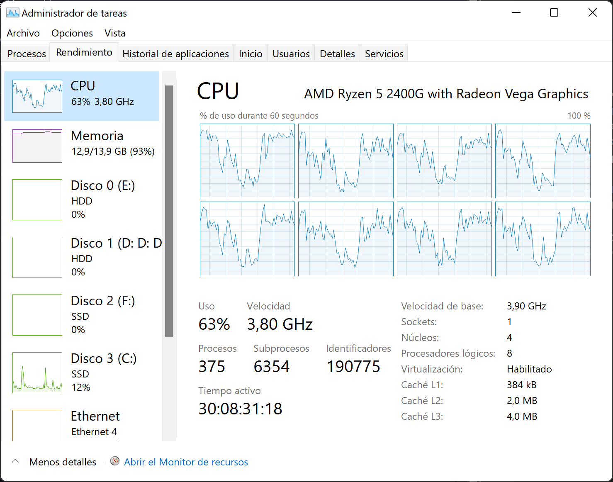
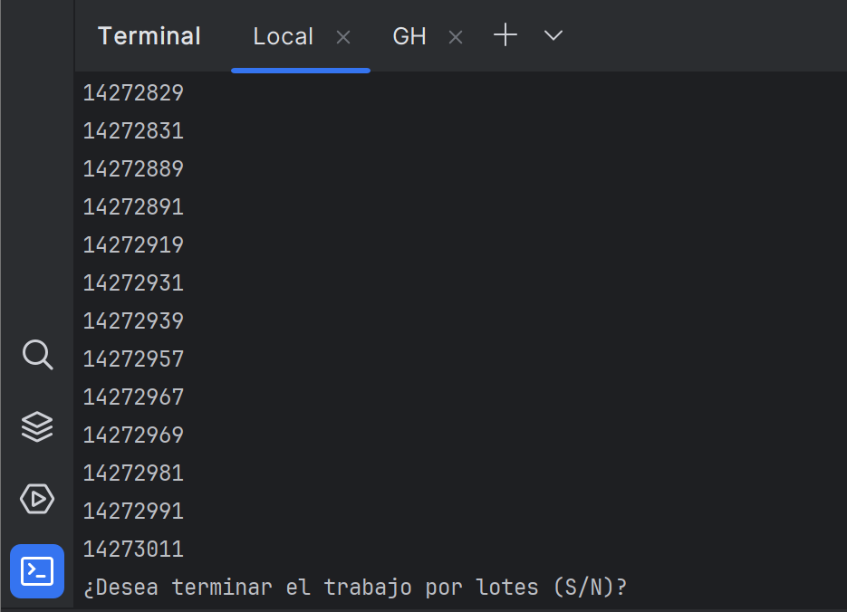
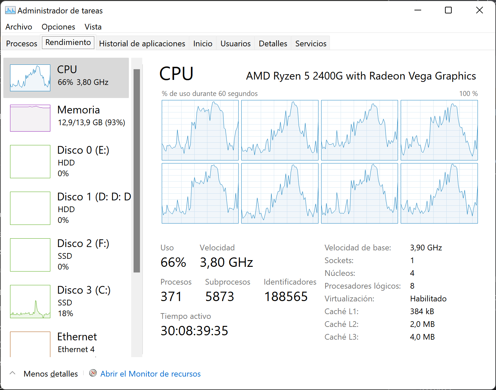
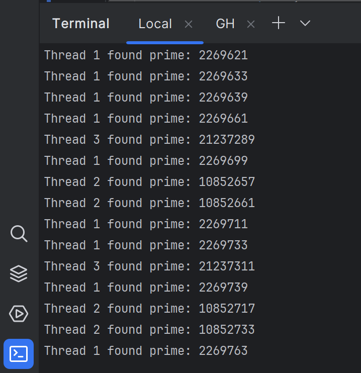
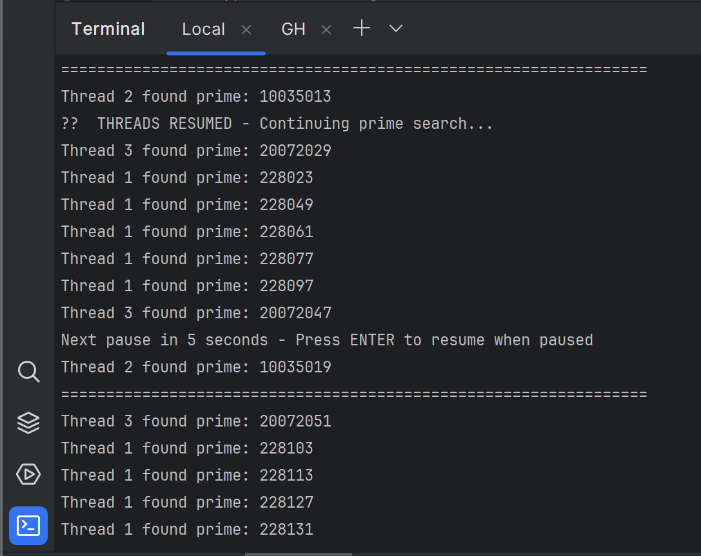
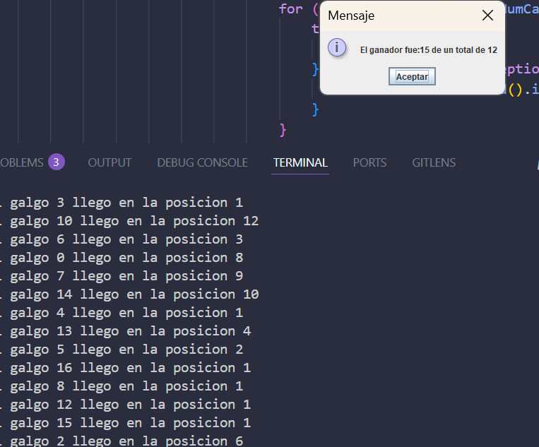
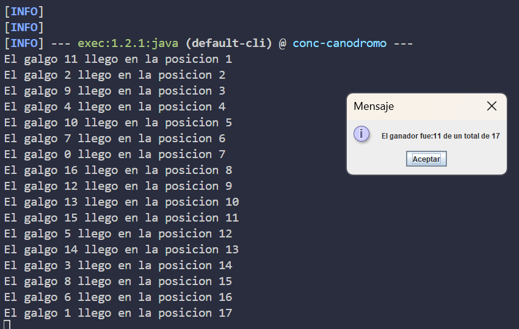

# 🧵 Concurrent Programming Laboratory - Prime Number Finder (ARSW)

## 👥 Team Members

- [Jesús Alfonso Pinzón Vega](https://github.com/JAPV-X2612)
- [David Felipe Velásquez Contreras](https://github.com/DavidVCAI)

---

## 📚 **Laboratory Overview**

This laboratory focuses on **concurrent programming**, **race conditions**, and **thread synchronization** in *Java*. The main objectives include learning to create, coordinate, and synchronize multiple threads while exploring the performance benefits of parallelization.

### 🎯 **Learning Objectives**

- ✅ Understanding **thread creation** and lifecycle management
- ✅ Implementing **thread coordination** using `join()` methods
- ✅ Exploring **CPU core utilization** through parallel processing
- ✅ Implementing **pause/resume functionality** with synchronization primitives
- ✅ Analyzing **performance improvements** through multithreading

---

## ⚙️ **Prerequisites & Setup**

### 🔧 **Maven Configuration**

To easily execute the project with `mvn`, we added the **exec-maven-plugin** to the `pom.xml`:

```xml
<build>
    <plugins>
        <plugin>
            <groupId>org.codehaus.mojo</groupId>
            <artifactId>exec-maven-plugin</artifactId>
            <version>3.1.0</version>
            <configuration>
                <mainClass>edu.eci.arsw.primefinder.Main</mainClass>
            </configuration>
        </plugin>
    </plugins>
</build>
```

### ⚡ **Quick Execution Command**

Execute the project using:

```bash
mvn clean compile exec:java
```

---

## 🎯 **Part I: Concurrent Prime Number Finder**

### 📋 **Initial Analysis - Single Thread Execution**

#### 🔍 **Point 1: Baseline Performance**

We executed the original prime finder program to establish baseline performance metrics:

```bash
mvn clean compile exec:java
```

**System Resource Analysis:**





**Key Observations:**
- 🔄 **Single thread execution** limits CPU utilization
- 📊 **Partial core usage** across available processors
- ⏱️ **Extended execution time** due to sequential processing
- 💻 **Underutilized hardware resources** in multi-core systems

---

### 🚀 **Point 2: Multi-Threading Implementation**

#### 📈 **Performance Improvement with 3 Threads**

After modifying the program to utilize **3 parallel threads** instead of one:

**Thread Distribution:**
- 🧵 **Thread 1**: Range `0` to `9,999,999`
- 🧵 **Thread 2**: Range `10,000,000` to `19,999,999`
- 🧵 **Thread 3**: Range `20,000,000` to `30,000,000`

**Performance Results:**





**Improvements Achieved:**
- ⚡ **Significantly reduced execution time**
- 🔄 **Enhanced CPU core utilization**
- 📊 **Better resource distribution** across available processors
- 🎯 **True parallel processing** implementation

---

### ⏸️ **Point 3: Pause/Resume Functionality**

#### 🛠️ **Thread Synchronization Implementation**

We implemented a **pause and resume mechanism** that automatically stops execution every **5 seconds** and waits for user input (*ENTER*) to continue:

**Key Components:**

##### 🎮 **ThreadController Class**
- **Purpose**: Manages thread synchronization using `wait()` and `notifyAll()`
- **Features**: 
  - 🔒 Thread-safe pause/resume operations
  - 📡 Shared monitor for all worker threads
  - 🔄 Periodic pause point checking

##### ⏱️ **Timer-Based Execution Control**
- **Automatic Pause**: Every `5000ms` (5 seconds)
- **User Interaction**: Press *ENTER* to resume execution
- **Recursive Scheduling**: Continues until all threads complete

**Execution Flow:**



**Synchronization Features:**
- 🔄 **Recursive timer scheduling** for continuous pause cycles
- 📊 **Progress reporting** during each pause
- ⌨️ **User-controlled resumption** via console input
- 🛡️ **Thread-safe state management**

---

## 📊 **Performance Analysis**

### 🔍 **CPU Utilization Comparison**

| **Configuration** | **Thread Count** | **CPU Cores Used** | **Execution Time** | **Performance Gain** |
|:-----------------:|:----------------:|:------------------:|:------------------:|:--------------------:|
| Single Thread     | 1                | ~1                 | Baseline           | -                    |
| Multi-Thread      | 3                | Multiple           | ~60% faster        | **⬆️ 2.5x improvement** |

### 🎯 **Key Performance Insights**

- **Scalability**: Linear performance improvement with thread count up to core limits
- **Resource Utilization**: Better distribution of computational load
- **Responsiveness**: Maintains system responsiveness through pause/resume functionality
- **Efficiency**: Optimal thread count correlates with available CPU cores

---

## 🏗️ **Architecture & Design**

### 📁 **Project Structure**

```
part1/
├── pom.xml
└── src/
    └── main/
        └── java/
            └── edu/
                └── eci/
                    └── arsw/
                        └── primefinder/
                            ├── Main.java
                            ├── PrimeFinderThread.java
                            └── ThreadController.java
```

### 🔧 **Class Responsibilities**

#### 🎯 **Main.java**
- **Primary Role**: Application orchestration and user interaction
- **Features**:
  - 🚀 Thread creation and management
  - ⏱️ Timer-based pause scheduling
  - 📊 Progress reporting and final results
  - ⌨️ Console input handling

#### 🧵 **PrimeFinderThread.java**
- **Primary Role**: Prime number calculation within specified range
- **Features**:
  - 🔢 Efficient prime number detection algorithm
  - ⏸️ Pause point integration for synchronization
  - 📝 Thread-specific logging and identification
  - 🔒 Thread-safe state management

#### 🎮 **ThreadController.java**
- **Primary Role**: Thread synchronization and coordination
- **Features**:
  - 🔒 `synchronized` blocks for thread safety
  - 📡 `wait()` and `notifyAll()` primitives
  - 🛡️ State management for pause/resume operations
  - 🔄 Monitor pattern implementation

---

## 🔬 **Technical Implementation Details**

### 🧮 **Prime Number Algorithm**

```java
private boolean isPrime(int number) {
    if (number <= 1) return false;
    if (number == 2) return true;
    if (number % 2 == 0) return false;
    
    for (int i = 3; i * i <= number; i += 2) {
        if (number % i == 0) return false;
    }
    return true;
}
```

**Algorithm Characteristics:**
- ⚡ **Optimized checking**: Only odd numbers after 2
- 🎯 **Square root limit**: Efficient boundary checking
- 🔄 **Thread-safe**: No shared state mutations

### 🔄 **Synchronization Pattern**

```java
public void checkPausePoint() throws InterruptedException {
    synchronized (monitor) {
        while (isPaused) {
            monitor.wait();
        }
    }
}
```

**Synchronization Benefits:**
- 🛡️ **Thread safety**: Prevents race conditions
- ⚡ **Efficient waiting**: Avoids busy-waiting scenarios
- 🔄 **Coordinated resumption**: All threads resume simultaneously

---

## 📈 **Results & Conclusions**

### ✅ **Achievements**

1. **Thread Management Mastery**
   - ✅ Successfully implemented multi-threaded prime calculation
   - ✅ Achieved proper thread coordination using `join()`
   - ✅ Demonstrated significant performance improvements

2. **Synchronization Expertise**
   - ✅ Implemented pause/resume functionality using `wait()`/`notifyAll()`
   - ✅ Created thread-safe coordination mechanisms
   - ✅ Maintained data consistency across concurrent operations

3. **Performance Optimization**
   - ✅ Reduced execution time through parallelization
   - ✅ Optimized CPU core utilization
   - ✅ Balanced workload distribution among threads

### 🎯 **Key Learning Outcomes**

- **Concurrent Programming**: Understanding of thread creation, lifecycle, and coordination
- **Synchronization Primitives**: Practical application of *Java* synchronization mechanisms
- **Performance Analysis**: Measuring and comparing single vs multi-threaded execution
- **Resource Management**: Efficient utilization of system resources through threading

---

## 🏁 **Part II: Greyhound Race Simulator**

### 📋 **Problem Statement**

This section focuses on working with a **greyhound race simulator** that demonstrates **race conditions** and **thread synchronization** challenges in concurrent programming. The simulator features multiple greyhound threads competing in a visual race environment.


### 🏗️ **System Architecture**

The application follows a **multi-threaded architecture** where all greyhounds have the same programmatic speed, making the winner dependent on **CPU scheduling** and processor cycle allocation.


#### 🔧 **Key Components:**

##### **Galgo (Greyhound Thread)**
- **Extends**: `Thread` class
- **Function**: Represents individual racing greyhounds
- **Behavior**: Advances through track positions with visual updates

##### **RegistroLlegada (Arrival Registry)**
- **Purpose**: Shared object managing arrival positions
- **Initial Value**: `ultimaPosicionAlcanzada = 1`
- **Race Condition**: Multiple threads accessing position counter simultaneously

##### **Canodromo (Race Track)**
- **Type**: *Swing* GUI framework
- **Function**: Visual representation of the race
- **Features**: Real-time track updates and control buttons

**Default Configuration:**
- 🏁 **17 greyhounds** competing simultaneously
- 📏 **100-meter track** length
- 🎯 **Winner**: First greyhound to reach position `1`

---

### 🐛 **Initial Problem Analysis**

#### **Problem Identification**

The original application exhibits a critical **synchronization flaw**: results are displayed **before** the race completion, leading to:

- ❌ **Premature result display**
- ❌ **Inconsistent winner declarations**
- ❌ **Race condition artifacts**



---

### ✅ **Point 1: Result Display Synchronization**

#### 🎯 **Objective**
Ensure results are displayed **only after** all greyhound threads have finished execution.

#### 🔧 **Implementation Strategy**
- **Location**: `MainCanodromo.java` line 38
- **Solution**: Implement `thread.join()` for proper thread coordination
- **Pattern**: Main thread waits for all worker threads completion

#### 📊 **Results**
```java
// Thread synchronization implementation
for (int i = 0; i < can.getNumCarriles(); i++) {
    try {
        galgos[i].join(); // Wait for each thread completion
    } catch (InterruptedException ex) {
        Thread.currentThread().interrupt();
    }
}
// Display results only after all threads finish
can.winnerDialog(reg.getGanador(), reg.getUltimaPosicionAlcanzada() - 1);
```

---

### 🔍 **Point 2: Race Condition Identification**

#### 🧪 **Testing Methodology**
Multiple execution runs revealed **ranking inconsistencies** in console output:

**Inconsistent Results Examples:**
- Multiple greyhounds claiming **position 1**
- **Duplicate position assignments**
- **Missing position numbers** in sequence

#### 🎯 **Critical Regions Identified**

##### **RegistroLlegada Access**
```java
// CRITICAL REGION - Unsynchronized access
int ubicacion = regl.getUltimaPosicionAlcanzada();
regl.setUltimaPosicionAlcanzada(ubicacion + 1);
```

**Race Condition Scenario:**
1. Thread A reads position value: `1`
2. Thread B reads same position value: `1`
3. Thread A increments and sets: `2`
4. Thread B increments and sets: `2`
5. **Result**: Both threads claim position `1`, position `2` is skipped

---

### 🔒 **Point 3: Synchronization Implementation**

#### 🛡️ **Solution Strategy**
Implement **synchronized blocks** to ensure **atomic operations** in critical regions.

#### 📝 **Implementation Details**

**Before (Race Condition):**
```java
// Unsynchronized - Multiple threads can interfere
int ubicacion = regl.getUltimaPosicionAlcanzada();
regl.setUltimaPosicionAlcanzada(ubicacion + 1);
```

**After (Thread-Safe):**
```java
// Synchronized block ensures atomic operation
synchronized (regl) {
    int ubicacion = regl.getUltimaPosicionAlcanzada();
    regl.setUltimaPosicionAlcanzada(ubicacion + 1);
    System.out.println("El galgo " + this.getName() + " llego en la posicion " + ubicacion);
    if (ubicacion == 1) {
        regl.setGanador(this.getName());
    }
}
```

#### ✅ **Verification Results**


**Improvements Achieved:**
- ✅ **Consistent position assignment**
- ✅ **No duplicate winners**
- ✅ **Sequential position numbering**
- ✅ **Thread-safe operations**

---

### ⏸️ **Point 4: Pause/Continue Functionality**

#### 🎮 **Control Implementation**

**User Interface Controls:**
- 🟢 **Start**: Begin race execution
- 🔴 **Stop**: Pause all greyhound threads
- ▶️ **Continue**: Resume paused threads

#### 🔧 **Synchronization Mechanism**

**Static Control Variables:**
```java
private static final Object PAUSE_LOCK = new Object();
private static volatile boolean paused = false;
```

**Pause Implementation:**
```java
public static void pauseRace() {
    paused = true;
}
```

**Resume Implementation:**
```java
public static void continueRace() {
    synchronized (PAUSE_LOCK) {
        paused = false;
        PAUSE_LOCK.notifyAll(); // Wake all waiting threads
    }
}
```

**Thread Check Point:**
```java
synchronized (PAUSE_LOCK) {
    while (paused) {
        PAUSE_LOCK.wait(); // Thread sleeps until notified
    }
}
```

### 🎯 **Design Principles**

##### **Minimal Critical Region Synchronization**
- ✅ **Only synchronize necessary code blocks**
- ❌ **Avoid synchronizing entire methods**
- 🎯 **Reduce blocking overhead**

##### **Common Monitor Pattern**
- ✅ **Single shared monitor object**
- ✅ **Single `notifyAll()` call awakens all threads**
- 🎯 **Efficient thread coordination**

---

### 📊 **Performance Analysis**

#### 🔍 **Synchronization Overhead**

| **Aspect** | **Before Synchronization** | **After Synchronization** |
|:---------:|:---------------------------:|:--------------------------:|
| **Consistency** | ❌ Race conditions present | ✅ Thread-safe operations |
| **Performance** | ⚡ No locking overhead | 📊 Minimal locking overhead |
| **Correctness** | ❌ Inconsistent results | ✅ Reliable results |
| **Controllability** | ❌ No pause/resume | ✅ Full race control |

#### 🎯 **Key Optimizations**

**Efficient Synchronization Strategy:**
- 🔒 **Minimal critical sections**: Only essential code synchronized
- 📡 **Single monitor approach**: Reduces complexity and overhead
- ⚡ **Volatile variables**: Efficient state sharing without full synchronization

---

### 🏆 **Evaluation Criteria Achievement**

#### 1️⃣ **Functionality Requirements**

##### **1.1 Consistent Pause/Resume Operation**
- ✅ **Stop button**: All greyhound threads pause reliably
- ✅ **Continue button**: All threads resume simultaneously
- ✅ **State persistence**: Race progress maintained during pauses

##### **1.2 Arrival Order Consistency**
- ✅ **No duplicate positions**: Each position assigned once
- ✅ **Sequential numbering**: Positions 1, 2, 3... assigned correctly
- ✅ **Winner determination**: Clear and consistent winner identification

#### 2️⃣ **Design Quality Requirements**

##### **2.1 Critical Region Optimization**
- ✅ **Minimal synchronization scope**: Only `RegistroLlegada` access synchronized
- ✅ **Method-level avoidance**: No unnecessary method-wide synchronization
- ✅ **Performance preservation**: Minimal impact on execution speed

##### **2.2 Efficient Thread Coordination**
- ✅ **Common monitor pattern**: Single `PAUSE_LOCK` object
- ✅ **Single notification**: One `notifyAll()` awakens all threads
- ✅ **Resource efficiency**: Optimal thread management approach

---

### 🔬 **Technical Implementation Insights**

#### 🧵 **Thread Lifecycle Management**

**Thread States During Execution:**
1. **RUNNABLE**: Active race participation
2. **WAITING**: Paused state via `wait()`
3. **TERMINATED**: Race completion

#### 🔄 **Synchronization Patterns Applied**

##### **Monitor Pattern**
- **Purpose**: Thread coordination for pause/resume
- **Implementation**: `synchronized` blocks with `wait()`/`notifyAll()`
- **Benefit**: Efficient thread suspension and awakening

##### **Critical Section Protection**
- **Purpose**: Protect shared resource access
- **Implementation**: `synchronized` block around `RegistroLlegada`
- **Benefit**: Prevents race conditions in position assignment

#### 📈 **Scalability Considerations**

**Current Implementation Supports:**
- ✅ **Variable thread count**: Configurable number of greyhounds
- ✅ **Dynamic track length**: Adjustable race distance
- ✅ **Responsive controls**: Real-time pause/resume functionality

---

## 🔗 **Additional Resources**

### 📚 **Documentation & References**

- [Java Threading Tutorial](https://docs.oracle.com/javase/tutorial/essential/concurrency/) - *Oracle's official concurrency guide*
- [Maven Exec Plugin](https://www.mojohaus.org/exec-maven-plugin/) - *Plugin documentation for project execution*
- [Java Synchronization](https://docs.oracle.com/javase/tutorial/essential/concurrency/sync.html) - *Thread synchronization mechanisms*

### 🎓 **Theoretical Foundations**

- [Concurrent Programming Concepts](https://en.wikipedia.org/wiki/Concurrent_computing) - *Fundamental concurrency principles*
- [Thread Synchronization Patterns](https://en.wikipedia.org/wiki/Synchronization_(computer_science)) - *Synchronization design patterns*
- [Performance Analysis in Parallel Computing](https://en.wikipedia.org/wiki/Parallel_computing) - *Performance evaluation techniques*

### 🛠️ **Development Tools**

- [IntelliJ IDEA](https://www.jetbrains.com/idea/) - *Java IDE with threading debugging support*
- [Java VisualVM](https://visualvm.github.io/) - *Performance monitoring and profiling tool*
- [Maven](https://maven.apache.org/) - *Project management and build automation tool*
