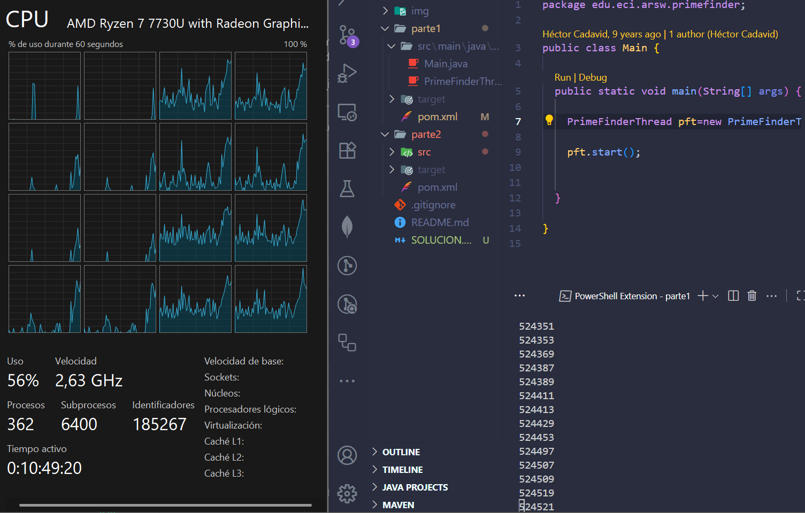

Integrantes: Jesus Pinzon y David Velasquez

Desarrollo del laboratorio 2.

En primer lugar, añadimos el plugin exec-maven-plugin al pom.xml para ejecutar fácilmente el proyecto con mvn:

<build>
    <plugins>
        <plugin>
            <groupId>org.codehaus.mojo</groupId>
            <artifactId>exec-maven-plugin</artifactId>
            <version>3.1.0</version>
            <configuration>
                <mainClass>edu.eci.arsw.primefinder.Main</mainClass>
            </configuration>
        </plugin>
    </plugins>
</build>

Así, con el comando mvn clean compile exec:java se ejecuta el limpiado, compilado y ejecución de Main.

Punto 1.

Ejecutamos el programa concurrente de primos con mvn clean compile exec:java. Abrimos el administrador de tareas de Windows y verificamos el uso de CPU. 

Aqui inicia

Aqui se lleva ejecutando un rato y termina

Esto nos confirma que, al tener un solo hilo, el programa no aprovecha el paralelismo de varios núcleos. Esto porque hay elementos del procesador, procesadores logicos que estan sin un uso completo, por lo que el programa aun estando en un solo hilo reparte recursos entre algunos disponibles pero no todos.
