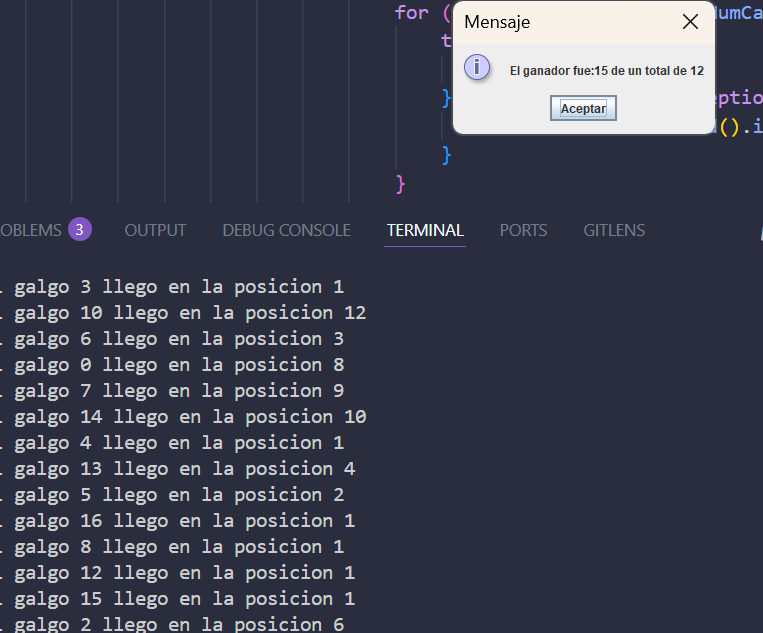
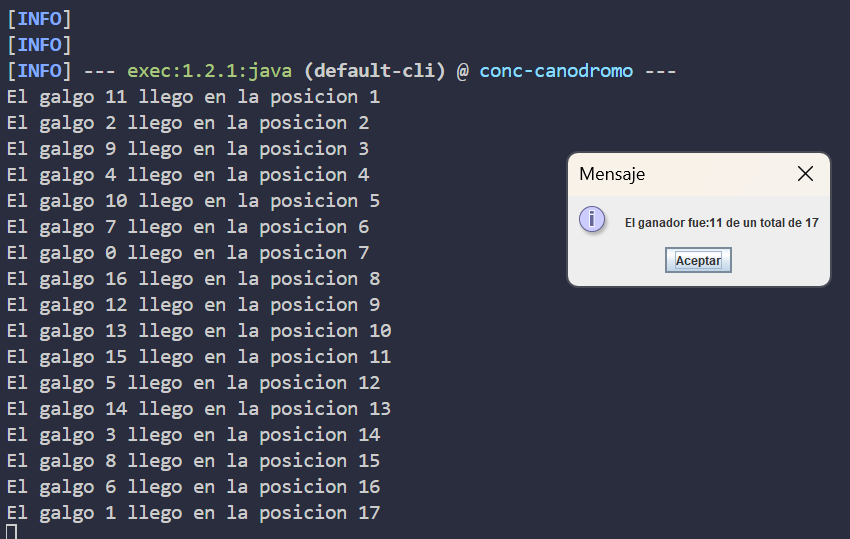

Integrantes: Jesus Pinzon y David Velasquez

Desarrollo del laboratorio 2.

En primer lugar, añadimos el plugin exec-maven-plugin al pom.xml para ejecutar fácilmente el proyecto con mvn:

<build>
    <plugins>
        <plugin>
            <groupId>org.codehaus.mojo</groupId>
            <artifactId>exec-maven-plugin</artifactId>
            <version>3.1.0</version>
            <configuration>
                <mainClass>edu.eci.arsw.primefinder.Main</mainClass>
            </configuration>
        </plugin>
    </plugins>
</build>

Así, con el comando mvn clean compile exec:java se ejecuta el limpiado, compilado y ejecución de Main.

Punto 1.

Ejecutamos el programa concurrente de primos con mvn clean compile exec:java. Abrimos el administrador de tareas de Windows y verificamos el uso de CPU. 

Aqui inicia

Aqui se lleva ejecutando un rato y termina

Esto nos confirma que, al tener un solo hilo, el programa no aprovecha el paralelismo de varios núcleos. Esto porque hay elementos del procesador, procesadores logicos que estan sin un uso completo, por lo que el programa aun estando en un solo hilo reparte recursos entre algunos disponibles pero no todos.

Parte 2

1.

Ejecutamos el proyecto del canódromo con mvn clean compile exec:java. La interfaz gráfica inicia y la carrera se puede lanzar, pero notamos que el funcionamiento no es correcto, en este momento muestra una ventana de ganador y ahi si deja iniciar, ls botones de pause, resume y demas no funcionan.

Vamos a analizar y modificar el código para asegurar que los galgos corran correctamente y que el registro de llegada sea consistente.

Listo entonces lo que hacemos es hacer que con un join() esperemos la ejecucion de todos antes de mostrar el ganador.

2 y 3. Junto con esta ejecucion y muchas otras identificamos algunas problematicas:

En primer lugar vemos que una region critica a ser atacada es el posicionamiento, se puede ver como varios hilos tratan al mismo tiempo de acceder al RegistroLlegada, lo que hace que hayan posiciones duplicadas. Esto tambien implica que el ganador se vaya reemplazando a medida que van llegando resultados iguales. Osea que los metodos get y set necesitan tener esto en cuenta.

Aplique synchronized a los metodos y se ve una mejora pero aun asi no funciona.

Vemos que otra region critica es en el Galgo como tal, debemos sincronizar tambien la parte que imprime su posicion de llegada. Haciendo esto vemos que ya funciona bien:

4. Implementación de pausa y continuar

Se implementó la funcionalidad de pausa y continuar en la carrera. Cuando se hace clic en 'Stop', todos los hilos de los galgos se suspenden usando wait/notifyAll sobre un lock estático en la clase Galgo. Al hacer clic en 'Continue', los hilos se despiertan y continúan la carrera.

Esto se logra agregando métodos estáticos pauseRace() y continueRace() en Galgo, y llamándolos desde las acciones de los botones en MainCanodromo. Así se garantiza que la sincronización sea correcta y la carrera pueda pausarse y reanudarse en cualquier momento.

